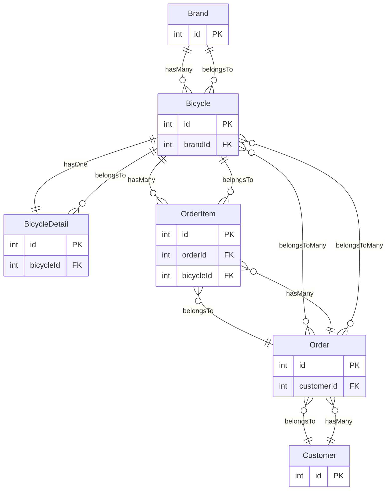

# Bicycle Shop Management System

A full-stack bicycle shop management application built with **TypeScript**, **React**, **Express**, **Sequelize**, and **MySQL**.

The project is structured as a separate frontend and backend application. The backend exposes a REST API for managing bicycles and brands, while the React frontend provides a user interface for bicycle CRUD operations.

## Project Links

- **GitHub Repository:** https://github.com/jonathannicolaslarazepeda/proyecto_bicicletas_tiburcio
- **Postman API Documentation:** https://documenter.getpostman.com/view/58320216/2sBYB4LS3J

## Tech Stack

### Frontend

- React 19
- TypeScript
- Vite
- Tailwind CSS
- Fetch API

### Backend

- Node.js
- Express 5
- TypeScript
- Sequelize 6
- MySQL
- CORS
- dotenv

## Project Structure

```text
TypeScript-React-Express-Sequelize-Example/
├── backend/
│   ├── src/
│   │   ├── config/
│   │   ├── middlewares/
│   │   ├── models/
│   │   ├── modules/
│   │   │   ├── bicycles/
│   │   │   └── brands/
|   |   |   └── bicicles-details/
│   │   │   ├── customers/
│   │   │   └── orders/
│   │   │   └── order-items/
│   │   ├── routes/
│   │   ├── app.ts
│   │   └── server.ts
│   ├── .env.example
│   ├── package.json
│   └── tsconfig.json
│
├── frontend/
│   ├── src/
│   │   ├── components/
│   │   ├── features/
│   │   │   └── bicycles/
│   │   ├── services/
│   │   ├── styles/
│   │   ├── App.tsx
│   │   └── main.tsx
│   ├── .env.example
│   ├── package.json
│   └── vite.config.ts
│
└── README.md
```

## Features

### Bicycle Management

The backend provides endpoints to:

- List all bicycles
- Retrieve a bicycle by ID
- Retrieve a bicycle together with its brand using eager loading
- Create a bicycle
- Update a bicycle
- Delete a bicycle

Each bicycle contains:

- `id`
- `brandId`
- `model`
- `description`
- `price`
- `stock`
- `createdAt`
- `updatedAt`

### Brand Management

The API also provides CRUD operations for bicycle brands:

- List all brands
- Retrieve a brand by ID
- Create a brand
- Update a brand
- Delete a brand

A brand contains:

- `brandId`
- `name`
- `createdAt`
- `updatedAt`

### Bicycle Details Management

The backend provides endpoints to:

- List all bicycles details
- Retrieve a bicycle details by ID
- Create a bicycle details
- Update a bicycle details
- Delete a bicycle details

Each bicycle contains:

- `id`
- `bicicleId`
- `frameMaterial`
- `wheelSize`
- `weight`
- `suspension`
- `createdAt`
- `updatedAt`

### Customers Management

The backend provides endpoints to:

- List all customers
- Retrieve a customer by ID
- Create a customer
- Update a customer
- Delete a customer

Each bicycle contains:

- `id`
- `name`
- `email`
- `createdAt`
- `updatedAt`


### Orders Management

The backend provides endpoints to:

- List all Orders
- Retrieve a order by ID
- Create a order
- Update a order
- Delete a order

Each bicycle contains:

- `id`
- `customerId`
- `orderDate`
- `status`
- `createdAt`
- `updatedAt`

### OrderItems Management

The backend provides endpoints to:

- List all OrderItems
- Retrieve a orderItems by ID
- Retrieve a orderItem together with its bicycle and order using eager loading
- Create a orderItem
- Update a orderItem
- Delete a orderItem

Each OrderItem contains:

- `id`
- `orderId`
- `bicycleId`
- `quantity`
- `unitPrice`
- `createdAt`
- `updatedAt`

### Database Relationship



## API Endpoints

The API base URL is:

```text
http://localhost:3000/api
```

### Bicycles

| Method | Endpoint | Description |
|---|---|---|
| GET | `/bicycles` | Get all bicycles |
| GET | `/bicycles/:id` | Get a bicycle by ID |
| GET | `/bicycles/eagerly/:id` | Get a bicycle with its brand |
| POST | `/bicycles` | Create a bicycle |
| PUT | `/bicycles/:id` | Update a bicycle |
| DELETE | `/bicycles/:id` | Delete a bicycle |

### Brands

| Method | Endpoint | Description |
|---|---|---|
| GET | `/brands` | Get all brands |
| GET | `/brands/:id` | Get a brand by ID |
| POST | `/brands` | Create a brand |
| PUT | `/brands/:id` | Update a brand |
| DELETE | `/brands/:id` | Delete a brand |

### Bicycles Details

| Method | Endpoint | Description |
|---|---|---|
| GET | `/bicycle-details` | Get all brands |
| GET | `/bicycle-details/:id` | Get a brand by ID |
| POST | `/bicycle-details` | Create a brand |
| PUT | `/bicycle-details/:id` | Update a brand |
| DELETE | `/bicycle-details/:id` | Delete a brand |

### Customer

| Method | Endpoint | Description |
|---|---|---|
| GET | `/customers` | Get all brands |
| GET | `/customers/:id` | Get a brand by ID |
| POST | `/customers` | Create a brand |
| PUT | `/customers/:id` | Update a brand |
| DELETE | `/customers/:id` | Delete a brand |

### Orders Details

| Method | Endpoint | Description |
|---|---|---|
| GET | `/orders` | Get all brands |
| GET | `/orders/:id` | Get a brand by ID |
| POST | `/orders` | Create a brand |
| PUT | `/orders/:id` | Update a brand |
| DELETE | `/orders/:id` | Delete a brand |

For request examples and response details, see the **Postman API Documentation** linked above.

## Prerequisites

Before running the project, make sure you have:

- Git
- Node.js and npm
- MySQL Server
- A MySQL user with permission to create and modify tables

A recent Node.js version compatible with the installed Vite version is recommended.

## Installation

### 1. Clone the repository

```bash
git clone https://github.com/jonathannicolaslarazepeda/proyecto_bicicletas_tiburcio.git
cd proyecto_bicicletas_tiburcio
```

### 2. Create the MySQL database

Start MySQL and create the database used by the backend:

```sql
CREATE DATABASE IF NOT EXISTS db_bicycle_shop CHARACTER SET utf8mb4;
```

The database must exist before starting the backend.

### 3. Configure the backend

Go to the backend directory:

```bash
cd backend
```

Create a `.env` file based on `.env.example`:

```env
PORT=3000

DB_HOST=localhost
DB_PORT=3306
DB_NAME=db_bicycle_shop
DB_USER=your-database-username
DB_PASSWORD=your-database-password
```

Replace the database credentials with your local MySQL configuration.

### 4. Install backend dependencies

From the `backend` directory:

```bash
npm ci
```

### 5. Configure the frontend

Open another terminal and go to the frontend directory:

```bash
cd frontend
```

Create a `.env` file based on `.env.example`:

```env
VITE_API_URL=http://localhost:3000/api
```

If the backend runs on a different host or port, update this value accordingly.

### 6. Install frontend dependencies

From the `frontend` directory:

```bash
npm ci
```

## Running the Application

The frontend and backend should be run in separate terminals.

### Start the backend

```bash
cd backend
npm run dev
```

The API will be available at:

```text
http://localhost:3000
```

The API endpoints are available under:

```text
http://localhost:3000/api
```

The root endpoint can be used to verify that the API is running:

```text
GET http://localhost:3000/
```

Expected response:

```json
{
  "message": "API is working"
}
```

### Start the frontend

In a second terminal:

```bash
cd frontend
npm run dev
```

Vite will display the local development URL, normally:

```text
http://localhost:5173
```

Open that URL in your browser.

## Production Build

### Backend

Create a TypeScript production build:

```bash
cd backend
npm run build
```

Then start the compiled server:

```bash
npm start
```

### Frontend

Create the production build:

```bash
cd frontend
npm run build
```

To preview the generated build locally:

```bash
npm run preview
```

## Database Behavior

When the backend starts, Sequelize authenticates the MySQL connection and synchronizes the models with the database.

The current server configuration uses:

```typescript
sequelize.sync({ force: true })
```

This recreates the database tables every time the backend starts. **Do not use this configuration in a production environment if you need to preserve existing data.**

## Frontend Architecture

The React application follows a feature-oriented structure.

The bicycle feature includes:

- Components for listing and managing bicycles
- A bicycle form
- Create/update modal
- Delete confirmation modal
- A custom `useBicycles` hook
- A service layer for API requests
- TypeScript types for bicycle data

The frontend communicates with the backend through the configured `VITE_API_URL`.

## Backend Architecture

The backend is organized by responsibility:

```text
Routes
  ↓
Controllers
  ↓
Services
  ↓
Sequelize Models
  ↓
MySQL
```

- **Routes** define HTTP endpoints.
- **Controllers** handle requests and responses.
- **Services** contain database operations and application logic.
- **Models** define the database structure through Sequelize.
- **Middlewares** handle errors and unknown routes.
- **Associations** define relationships between Sequelize models.

## Error Handling

The Express application includes middleware for:

- Unknown routes
- Application errors

The controllers also return appropriate HTTP status codes for common cases, such as:

- `200 OK` for successful queries and updates
- `201 Created` for successful creation
- `204 No Content` for successful deletion
- `400 Bad Request` for missing required input
- `404 Not Found` when a requested resource does not exist

## API Documentation

Complete API documentation, including request examples and responses, is available in Postman:

**Postman Documentation:**  
https://documenter.getpostman.com/view/58320216/2sBYB4LS3J

## Repository

The source code is available on GitHub:

**GitHub Repository:**  
https://github.com/jonathannicolaslarazepeda/proyecto_bicicletas_tiburcio

## Development Scripts

### Backend

| Command | Description |
|---|---|
| `npm run dev` | Starts the backend in development mode with automatic reload |
| `npm run build` | Compiles TypeScript to JavaScript |
| `npm start` | Starts the compiled backend |

### Frontend

| Command | Description |
|---|---|
| `npm run dev` | Starts the Vite development server |
| `npm run build` | Type-checks and builds the frontend |
| `npm run lint` | Runs Oxlint |
| `npm run preview` | Previews the production build |

## Environment Variables

### Backend

| Variable | Description | Example |
|---|---|---|
| `PORT` | Port used by the Express server | `3000` |
| `DB_HOST` | MySQL server host | `localhost` |
| `DB_PORT` | MySQL server port | `3306` |
| `DB_NAME` | MySQL database name | `db_bicycle_shop` |
| `DB_USER` | MySQL username | `root` |
| `DB_PASSWORD` | MySQL password | `your-password` |

### Frontend

| Variable | Description | Example |
|---|---|---|
| `VITE_API_URL` | Base URL of the backend API | `http://localhost:3000/api` |

## License

This project is currently distributed without a specific open-source license declaration.
